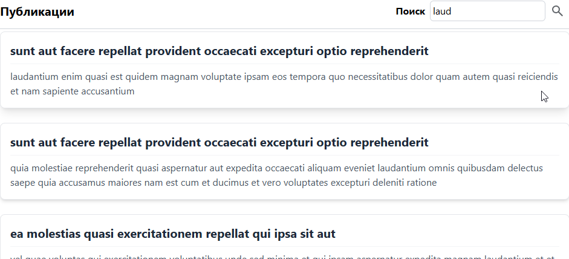

# Взаимодействие с публикациями

## База данных
Пример проектирования базы данных находится по пути *database/initBlogDatabase.sql*

## Подключение к базе данных
Подключение к базе данных выполнено в виде Singleton-класса *database/connectDatabase.php*

## Инициализация ресурсов
Для загрузки тестовых данных был разработан скрипт, 
позволяющий сохранить данные с удаленного ресурса - *resources/php/initBlogData.php*

```bash
    php resources/php/initBlogData.php
```
### Результат работы скрипта


## Отображение данных и поиск
В простом файле index.html реализован базовый поиск публикаций, основанный на содержимом
комментариев.

### Страница по умолчанию


### Поиск записей
